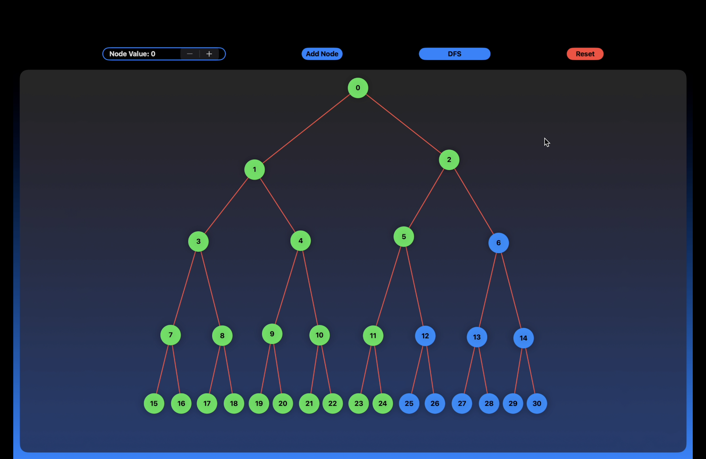

# GraphV: Graph Visualization Tool
GraphV is a graph visualization tool. It allows users to create, edit, and traverse graphs with ease. With GraphV, you can add nodes, connect them, and apply graph traversal algorithms to navigate through the graph. The app provides a user-friendly interface and smooth animations to enhance the visualization experience.

## Features
- **Node Manipulation**: Add nodes and move them freely across the screen.
- **Graph Editing**: Connect nodes to create custom graphh. Select the source and destination nodes.
- **Traversal Algorithms**: Choose from Depth-First Search (DFS) and Breadth-First Search (BFS) algorithms to traverse the graph.
- **Traversal Animation**: Watch as the algorithm traverses through the graph with animated node movements.

## Creating Graph

## Traversal Animation

## How to use
#### Adding Nodes:
- Select a value from the stepper to assign a value to your node.
- Click the "Add Node" button to create a new node, which will appear at the top-left corner of the screen.
- Drag and drop the node to reposition it anywhere on the screen.

#### Connecting Nodes:
- Click or tap on a node to select it.
- Choose the node to which you want to connect the selected node from the dropdown menu.
- Ensure to select the option "Make Source" for a node to designate it as the starting point for traversal.

#### Traversal:
- After designating a source node, you can optionally select a destination node.
- Choose between Depth-First Search (DFS) and Breadth-First Search (BFS) traversal algorithms.
- Watch as the traversal animation unfolds, either reaching the destination node or covering the entire graph based on your selection.

## Requirements
- iOS device or simulator running iOS 16.0 or later.
- Xcode 14.0 or later.

## Installation
- Clone the repository:
- Open the project in Xcode.
- Build and run the app on your iOS device or simulator.
